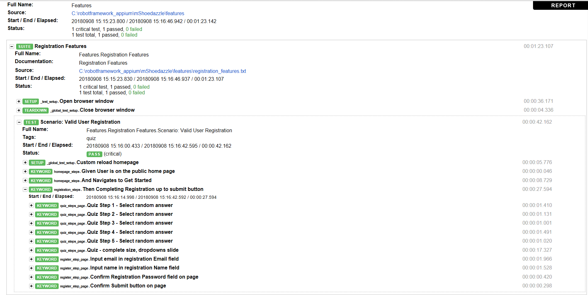

# RobotFrameworkAppium_SD_PageObjectModel

## Install Python 3, Robot Framework, and Robot Framework's Appium Library
* For Python 3, download latest stable version here: https://www.python.org/downloads/
* For Robot Framework, open command line and enter: `pip install robotframework`
* For Robot Framework AppiumLibrary, in command line enter: `pip install robotframework-appiumlibrary`

## Appium set up and installation
* Install node.js: https://nodejs.org/en/
* Open node.js command line and enter: `npm install -g appium`
* In node.js command line, install appium-doctor to make sure appium is installed with all needed dependencies: `npm install -g appium-doctor`
* For Android: in node.js command line: run appium-doctor check: `appium-doctor --android`
* For iOS: in node.js command line: run appium-doctor check: `appium-doctor --ios`
* If appium-doctor reports any failed dependencies, follow the instructions on how to resolve the dependencies and then rerun appium-doctor command when ready.
* Once appium-doctor reports that all dependencies are met, we need to start the appium server.
* Open a command line and enter: `appium`
* The server should start up. Appium server is now running and ready to receive input on 127.0.0.1:4723 (4723 is the default port. If desired, it can be changed when starting the appium server via `appium --port <port number>`)
* For further instructions/details on this and additional set up, please review the Appium Getting Started documentation: http://appium.io/docs/en/about-appium/getting-started/

## Running test
* By default it is set up to run on an Android device using Chrome browser. If your mobile or emulator does not match these default settings, you can change it in the `shared_resources/custom_functions/\_global_test_setup.txt` file under `Create Mobile Emulation` keyword.
* Open command line in repository main folder directory and enter: `pybot .`

## Log Report Examples

